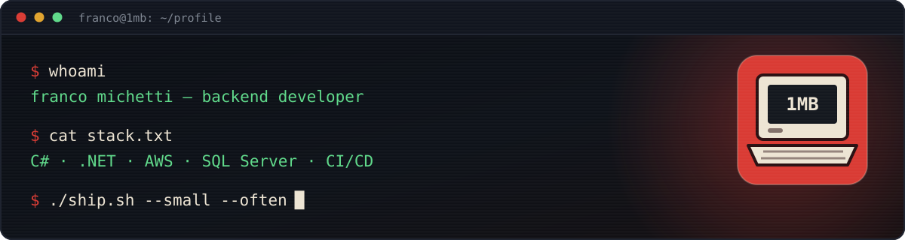

<div align="center">
  <a href="https://portfolio.francomichetti.com">
    
  </a>
</div>

<div align="center">

  <a href="https://portfolio.francomichetti.com">
    
  </a>
  <a href="https://www.linkedin.com/in/francomichetti/">
    
  </a>

</div>

---

### `> whoami`

```csharp
public sealed record Franco()
{
    public string   Role      => "Backend Developer";
    public string   Location  => "Buenos Aires, AR → Remote";
    public string[] Focus     => ["APIs", "Cloud infrastructure", "CI/CD"];
    public string[] Fuel      => ["mate", "small commits", "my family"];

    public string Philosophy  => "Ship it small. Ship it often. Keep it running.";
}
```

I build backend systems that other people's products depend on — APIs, cloud
infrastructure, and the pipelines that get them to production without drama.
AWS certified, self-directed, and happiest when the deploy is boring.

Outside the terminal: husband, father of two, and slowly building things I hope
will outlive my attention span.

<br />

### `> cat stack.txt`

**Core**

<p>
  
  
  
  
</p>

**Cloud &amp; Infrastructure**

<p>
  
  
  
  
</p>

**Data &amp; Tooling**

<p>
  
  
  
</p>

<br />

### `> ls certifications/`

<p>
  
  
  
</p>

<br />

### `> git log --oneline --featured`

<!-- Tip: keep this short. A short list of good work beats a long list of everything. -->

<table>
  <tr>
    <td width="50%" valign="top">
      <h4><a href="https://github.com/onembyte/alpheus">▸ alpheus</a></h4>
      <p>The macOS storage pane, but honest — see what is actually eating your disk, drill into it, and fix it from the same window.</p>
      <p>
        
        
        
      </p>
    </td>
  </tr>
</table>

<!-- Template for the next featured repo (2 per <tr>). Paste inside the <tr> above and fill in.
     Badge colors: one primary D93B34 badge per card for the headline tech, 2F3745 for the rest.
     Verify any logo= slug exists in simple-icons first; a bad slug renders as a blank gap.
    <td width="50%" valign="top">
      <h4><a href="https://github.com/onembyte/REPO">▸ REPO</a></h4>
      <p>One line on what it does and who it's for. Lead with the problem, not the stack.</p>
      <p>
        
      </p>
    </td>
-->

<br />

### `> gh stats --live`

<div align="center">

  
  

  <br /><br />

  

</div>

<br />

---

<div align="center">
  <sub><code>franco@1mb:~$</code> open to backend &amp; cloud work — francomichetti05@gmail.com, I answer within 48h.</sub>
</div>

